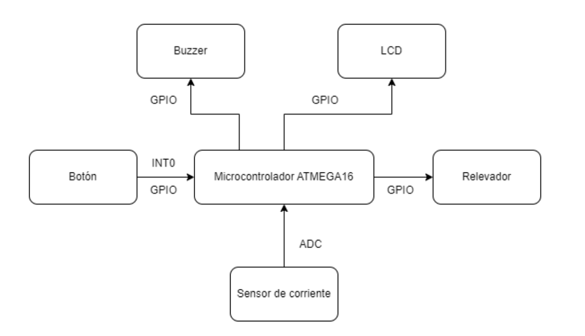
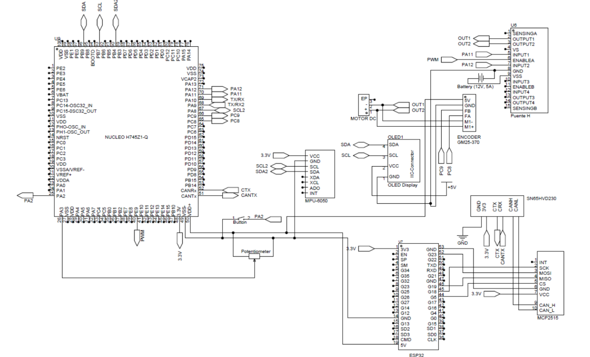
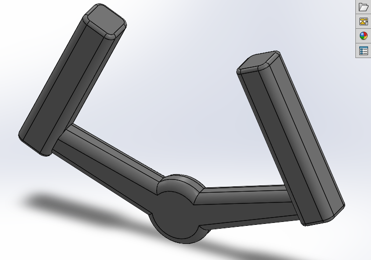
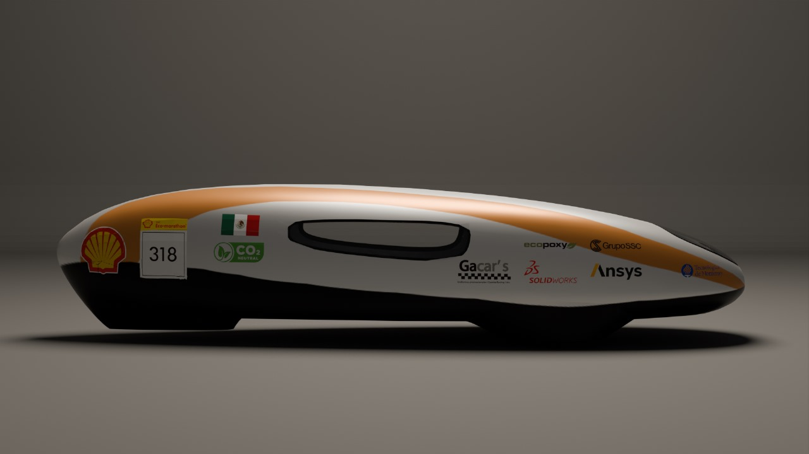
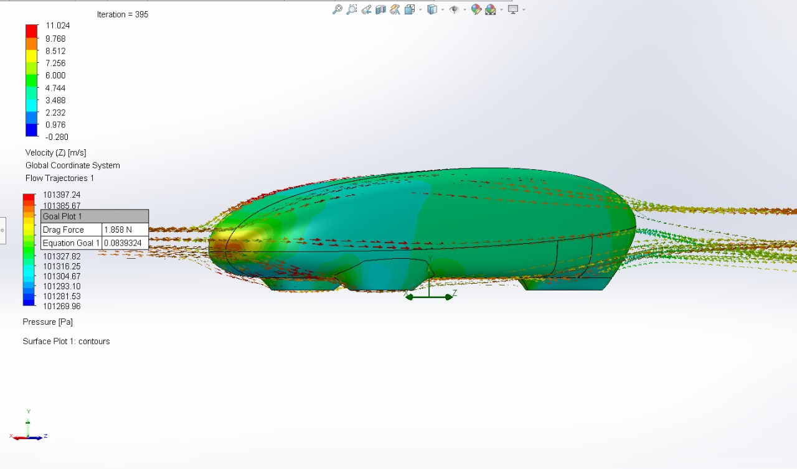

## Selected Projects in Embedded Systems, Systems on Chip, Robotics, Logic Design and Automotive

---
### 1. Intelligent Power Inlet System using ATmega16

In many places like schools or offices, devices are often left turned on overnight, causing increasing energy costs. In this project I aimed to address this issue by creating intelligent power inlet. The system measures the current consumption of connected devices and automatically powers off to save energy. 

[View code on Github](https://github.com/anromero21/Shell-Firmware-2023.git)

---
### 2.Steering angle system using STM32 Nucleo-H745Z1-Q

In this project, I implemented the following methodology: first, the steering wheel angle was accurately measured to obtain precise data with an encoder AS5600. Next, the measured data was displayed on a TFT screen. The user interface was meant to be readable and precise, by providing clear and understandable results. Simultaneously, a cloud-based dashboard was created to control the system through an IoT interface. Then, a PID control system was implemented to ensure optimal performance in DC Motor RS390. Finally, a real-time vibration analysis was implemented to obtain fault information using FFT. 

<video controls src="images/Reto_Final.mp4" title="Final Results" width="450" height="270"></video>

[View code on Github](https://github.com/anromero21/Shell-Firmware-2023.git)

---
### 3. Electric Prototype Design and Manufacture

I was Co-Captain of the EcoVolt Racing Team and part of the design and development of electric prototypes to compete at Shell Eco-Marathon. First, I was in charge of Design and Aerodynamics, an area with a focus on optimizing the vehicle's body and the aerodynamic efficiency. In this role, I led a multidisciplinary team, contributing to the conceptualization, design, and manufacture of the body. My responsibilities included fabricating the vehicle body, designing and simulating car components using CAD software and working with a variety of machinery and tools. Additionally, I incorporated sustainable materials into the vehicle construction. We have been three-time champions of the Carbon Footprint Reduction Award ([View Teams's Video](https://www.instagram.com/reel/C2SM8KvsF1q/)). Finally, I fostered a collaborative team environment, promoting open communication and teamwork to achieve project objectives.

    
    
    

[View EcoVolt Racing Team Social Media](https://www.instagram.com/ecovoltccm/)

---
### 4. Fiel Oriented Current Control, Phase Transformations (Clark-Park Transformation )

During my time at EcoVolt Racing Team, I contributed to the development of codes for efficient control of electric motors as part of a firmware development project. My contribution focused on two key areas: first, the implementation of Clarke and Park Transformations. I was responsible for implementing the Clarke and Park transformations. These transformations enable a clear and manageable representation of the motor's electrical variables, facilitating precise control of speed and torque. Next, integration of Field-Oriented Control (FOC). I integrated the Field-Oriented Control (FOC) method into our electric motor control systems. This technique utilizes the Clarke and Park transformations to decouple the control of motor current and voltage, allowing independent control of magnetic flux and torque.

[View code on Github](https://github.com/anromero21/Shell-Firmware-2023.git)

