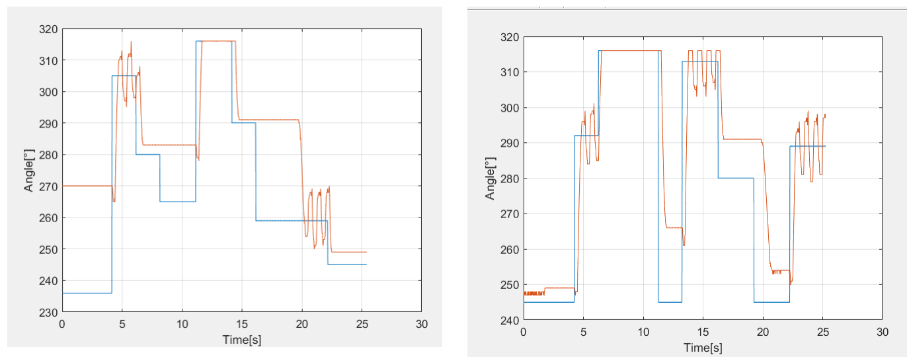

## Selected Projects in Embedded Systems, Systems on Chip, Robotics, Logic Design and Automotive

**Project description:** Lorem ipsum dolor sit amet, consectetur adipiscing elit, sed do eiusmod tempor incididunt ut labore et dolore magna aliqua. Ut enim ad minim veniam, quis nostrud exercitation ullamco laboris nisi ut aliquip ex ea commodo consequat. Duis aute irure dolor in reprehenderit in voluptate velit esse cillum dolore eu fugiat nulla pariatur. Excepteur sint occaecat cupidatat non proident, sunt in culpa qui officia deserunt mollit anim id est laborum.
---
### 1. Intelligent Multi-contact System using ATmega16

In many places like schools or offices, devices are often left on overnight, unnecessarily increasing energy costs. In this project I aimed to address this issue by creating intelligent multi-contacts capable of measuring the current consumption of connected devices and automatically shutting off to save energy. This is achieved through the design and construction of a multi-contact capable of measuring the current consumption of three devices and controlling the flow of electric current within a predetermined period using relays.

### 2.Steering angle system using STM32 Nucleo-H745Z1-Q

In this project, I undertook the following steps: firstly, the steering wheel angle was accurately measured to obtain precise data with an encoder AS5600. Then, a PID control system based on the measured values was implemented to ensure optimal system performance in DC Motor RS390. A real-time data reading system was developed to obtain accurate and reliable measurements to get information from the encoder and from a MPU6050 to analyse the motor's vibrations with FFT. Additionally, a dashboard was created to control the system through an IoT interface, enabling connection to the cloud for remote monitoring. Finally, the measured data was displayed in a readable and precise manner, providing clear and understandable results while controling the steering direction from the cloud.

<video controls src="images/Reto_Final.mp4" title="Final Results" width="480" height="270"></video>

### 3. Electric Prototype Design and Manufacture (Experience with machinery from a mechanicalworkshop, Body Manufacture, Design and Simulation of Steering Wheel, Design of car pieces, Resin Infusion, incorporation of sustainable materials,Teamwork and Leadership)

As Co-Captain of the EcoVolt Racing Team, I was part of the design and development of cutting-edge electric prototypes for competitive racing at the Shell Eco-Marathon for 3 years. Furthermore I was in charge of Design and Aerodynamics, an area with a focus on optimizing the vehicle's body and the aerodynamic efficiency. In this role, I led a multidisciplinary team, contributing to the conceptualization, design, and manufacture of the body. My responsibilities included fabricating the vehicle bodie, designing and simulating car components using CAD software and working with a variety of machinery and tools from a mechanical workshops. Additionally, I implemented resin infusion techniques and incorporated sustainable materials into the vehicle construction. We have been three-time champions of the Carbon Footprint Reduction Award. Throughout my tenure, I fostered a collaborative team environment, promoting open communication and teamwork to achieve project milestones and objectives. During my stay in the team I managed to participate in the construction of 3 prototypes.

[View EcoVolt Racing Team Social Media](https://www.instagram.com/ecovoltccm/)

### 3. Fiel Oriented Current Control, Phase Transformations (Clark-Park Transformation )

During my time at EcoVolt Racing Team, I contributed to the development of fundamental codes for efficient control of electric motors as part of a comprehensive firmware development project. My contribution focused on two key areas of the project:

1. Implementation of Clarke and Park Transformations: I was responsible for implementing the Clarke and Park transformations. These transformations enable a clear and manageable representation of the motor's electrical variables, facilitating precise control of speed and torque.
2. Integration of Field-Oriented Control (FOC) Method: Additionally, I integrated the Field-Oriented Control (FOC) method into our electric motor control systems. This technique utilizes the Clarke and Park transformations to decouple the control of motor current and voltage, allowing independent control of magnetic flux and torque.

[View code on Github](https://github.com/anromero21/Shell-Firmware-2023.git)

